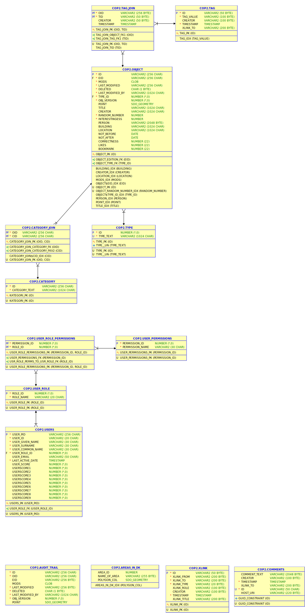

# Developer documentation

## COP database



## COP API description

https://github.com/kb-dk/access-digital-objects/blob/master/cop-backend.md

## Implementation 

All web services are implemented as using jersey and placed in the package
dk.kb.cop3.backend.crud.api;

Services that reads data uses a MetadataSource implementation to fetch
data from the Database and parses the result to a MetadataFormulator
implementation, which transforms the result to the requested format.

Services that write data uses a MetadataWriter implementation, to
write data to the database.  If the service receives mods to
create/update an object, the class ObjectFromModsExtractor to
transform the mods to a java object

Web services for reading data uses a (Meta)dataSource for read date
from the database or perform a search in solr The result is then given
to a formulator located in

## Local development environment

### Use a local postgres docker image

Go to src/docker

* Build with: 

```docker-compose up -d```

* Start/stop with: 

```docker-compose start/stop```

* Connect to database

| parameter | value |
|:----------|------:|
| host | localhost |
| port | 25432 |
| database | cop |
| userId | cop |
| password | cop123 |

* To get a fresh database

```
docker-compose down
docker volume prune -f
docker-compose up -d
```

## Data migration

For at kunne migrere data fra Oracle til Postgres har vi hbm-filer og java-klasser for Oracle 

hbm-filer og hibernate configuration for Oracle ligger i 
main/resources/oracle

Oracle java klasser ligger i 
main/java/dk/kb/cop3/backend/migrate/hibernate

## Running at command line

```
java -cp `ls target/cop3-backend/WEB-INF/lib/*jar | perl -ne 's/\n/:/;print;'`:target/classes:src/main/resources/  dk/kb/cop3/backend/migrate/CreateDB
```


